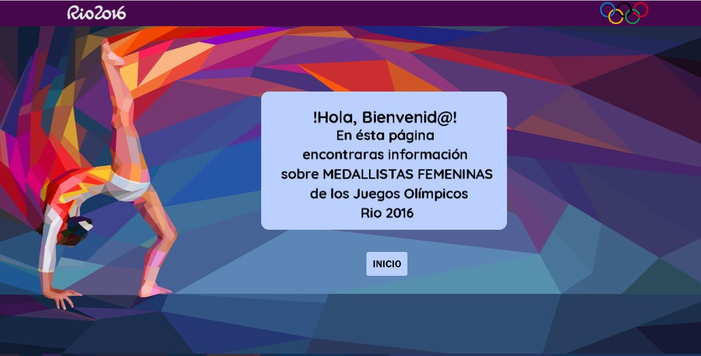
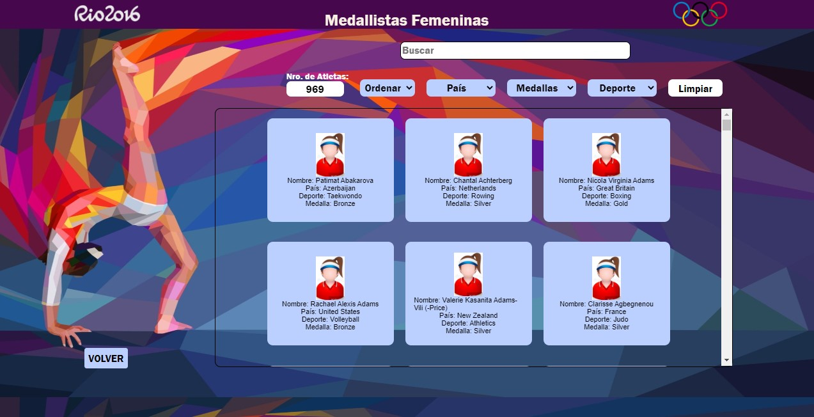
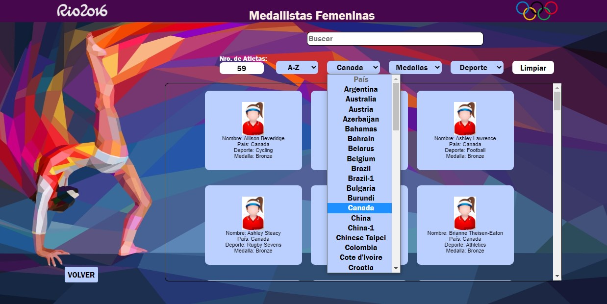
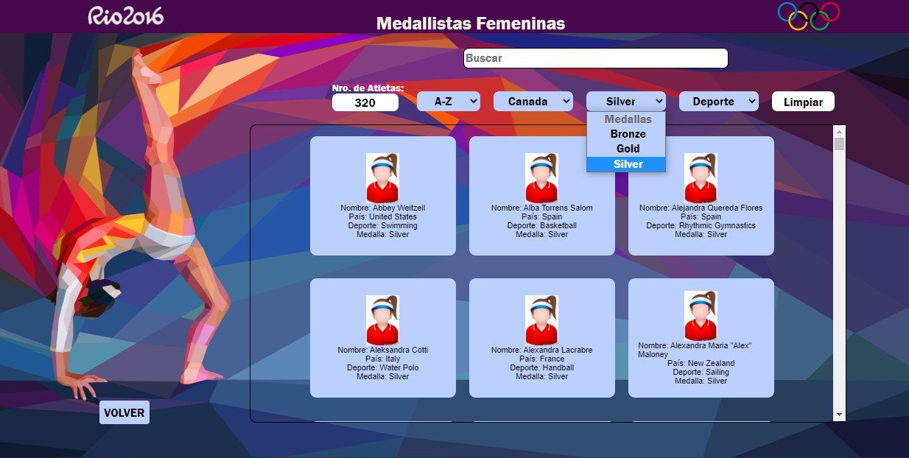
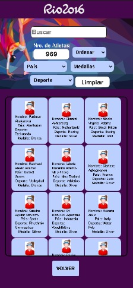
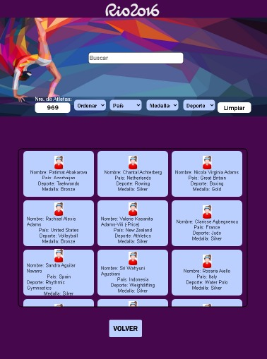
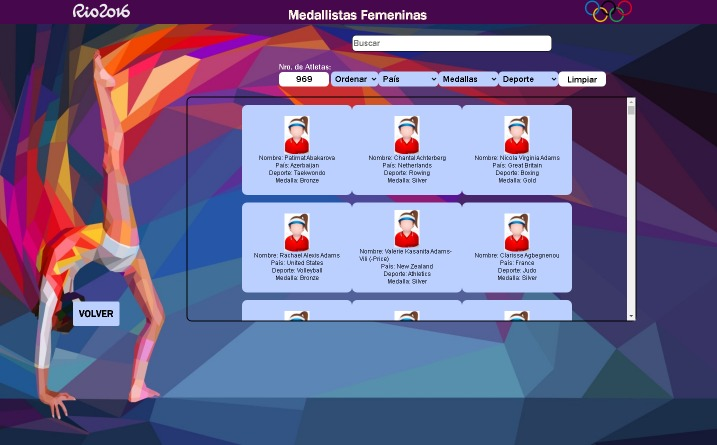
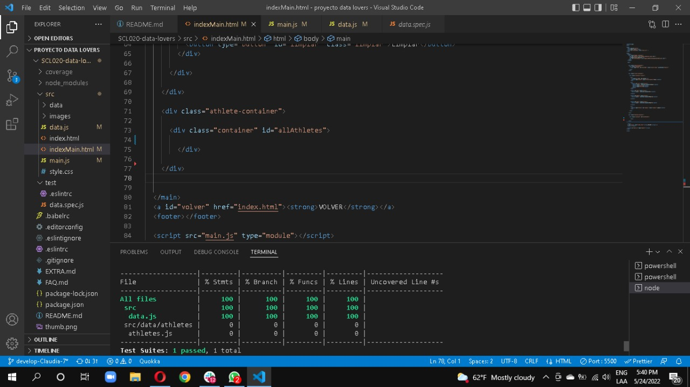

# Data Lovers

# Nombre del Proyecto: Medallistas Olímpicas Femeninas Río 2016

## 1. Preámbulo

Los Juegos Olímpicos de Río de Janeiro 2016,​ oficialmente conocidos como los Juegos de la XXXI Olimpiada, o más comúnmente como Río 2016, fue un evento multideportivo internacional, celebrado en la ciudad de Río de Janeiro, Brasil, entre el 5 y el 21 de agosto de 2016. También se realizaron en dicha ciudad los XV Juegos Paralímpicos, entre el 7 y el 18 de septiembre del mismo año.

## 2. Resumen del proyecto

En este proyecto encontrarás una página web con una Linda Interfaz en donde podrás visualizar un conjunto de datos relacionados con las atletas medallistas femeninas que participaron en los Juegos Olímpicos de Río 2016. Dichos datos se mostrarán en tarjetas por cada una de las atletas en donde se registran datos importantes como su Nombre, País al cual pertenece, Disciplina en la que participó y Medalla Obtenida. De igual manera podrás buscar por nombre a la atleta de tu interés, así como también filtrarlas por equipo, medalla y disciplina. Además se pueden ordenar las tarjetas  en orden alfabético de manera ascendente y descendente y en todo momento se mostrará el número total de atletas de acuerdo a la búsqueda y filtro ejecutado.

## 3. Objetivos de aprendizaje

Uso de HTML semántico, uso de selectores de CSS, modelo de caja (box model): borde, margen, padding, Uso de flexbox en CSS, uso de selectores del DOM, manejo de eventos del DOM (listeners, propagación, delegación), manipulación dinámica del DOM, tipos de datos primitivos, Diferenciar entre tipos de datos primitivos y no primitivo, Arrays (arreglos),Objetos (key, value),  Variables (declaración, asignación, ámbito), uso de condicionales (if-else, switch, operador ternario, lógica booleana), uso de bucles/ciclos (while, for, for..of), funciones (params, args, return), pruebas unitarias (unit tests), módulos de ECMAScript (ES Modules), Uso de linter (ESLINT), Uso de identificadores descriptivos (Nomenclatura y Semántica), Diferenciar entre expresiones (expressions) y sentencias (statements), Control de Versiones (Git y GitHu, Git: Instalación y configuración, Git: Control de versiones con git (init, clone, add, commit, status, push, pull, remote), GitHub: Creación de cuenta y repos, configuración de llaves SSH, GitHub: Despliegue con GitHub Pages, GitHub: Colaboración en Github (branches | forks | pull requests | code review | tags). Diseñar un producto o servicio poniendo a la usuaria en el centro. Crear prototipos de alta fidelidad que incluyan interacciones. Seguir los principios básicos de diseño visual. Planear y ejecutar testeos de usabilidad de prototipos en distintos niveles de fidelidad.

## 4. Detalles del proyecto

## Historias de usuario

Usuaria Nro 1.

  Es una joven mujer de 21 años de edad que practica atletismo, pues su próxima meta es participar en las venideras olimpiadas, por lo que le interesa conocer datos tales como: país, nro de athletas y medallas obtenidas de las deportistas que pertenecen a la misma disciplina que ella practica.   

  Criterios de aceptación:
- Que pueda visualizar las atletas femeninas pertenecientes a las disciplina de atletismo.
- Que escriba el nombre de la atleta que busca y le muestre el resultado.
- Que  muestre el total de atletas de la disciplina de atletismo.

Usuaria Nro 2.

Yo como tenista de 25 años que participará en las próximas olimpiadas quiero filtrar la información por deportes para saber quiénes fueron medallistas en mi especialidad.

  Criterios de aceptación:
- Debe haber una opción para seleccionar medallistas por deporte.
- Debe mostrar tarjeta con nombre, deporte, país y medalla.
- Se debe mostrar cantidad de atletas por deporte.
- Debe haber una barra de búsqueda por nombre de atletas.

 Usuario Nro 3.

  Es un hombre periodista de 45 años de edad que cubre las fuentes
 de deporte de un canal de television, se encuentra preparando un reportaje acerca
 de las olimpiadas de Rio 2016 y le gustaria obtener informacion de las atletas femeninas que participaron en esa edición, 
por lo cual le interesa poder filtrar por país, medalla obtenida y también ordenar de la A-Z y de la Z-A para tener
 más fácil acceso a nombres de competidoras.
  Criterios de aceptación:
- Que pueda filtrar por país.
- Que pueda filtrar por medalla.
- Que la data pueda ser ordenada por orden alfabético de la A-Z y de la Z-A.

#### Prototipo de alta fidelidad

Realizamos un prototipo de alta fidelidad en figma, y llevamos nuestro diseño a la pagina con la creacion 
de HTML y le dimos estilo con CSS, pero no nos gustó el resultado obtenido y luego de feedbacks recibidos 
por nuestras compañeras y coaches decidimos replantear nuestro diseño inicial, por lo cual acordamos realizar 
un diseño por cada una de las integrantes del equipo como propuesta. De lo cual, tomamos de los diseños de cada una, lo que más nos gustó y lo llevamos a un diseño general que es el que tenemos como diseño final de nuestra página.

#### Testeos de usabilidad

Luego de la creacíon de la página, tuvimos 3 pruebas de usabilidad con 3 usuarios distintos, 
2 de ellos mujeres y 1 hombre. Para los usuarios la página resultó bastante amigable 
visualmente y en su interfaz. Me comentaron que les fue fácil entender la temática de la página una vez habian
ingresado a ella y los filtros funcionaron de manera muy intuitiva, por lo cual fue fácil para ellos
acceder al contenido de su interés.

### Implementación de la Interfaz de Usuario (HTML/CSS/JS)

En nuestro proyecto se logró durante la implementación de usuarios:

1. Mostrar la data en una interfaz: Cards:

2. Permitir al usuario interactuar para obtener la infomación que necesita.

Ejemplo: Búsqueda por País:

Ejemplo: Búsqueda por Medalla:

Ejemplo: Ordenar las tarjetas de forma ascendente:

3. Interfaz responsive:

  Se diseñaron 4 interfaces para 4 tipos de dispositivos:

  Movil:

  Tablet:

  

  Laptop:

  

  Desktop:

  

### Pruebas unitarias

En la creación de los test de usuario se tomaron 5 atletas de la data general 
para ser utilizada como data de prueba, para lo cual se tomó en consideración 
que éstos  atletas tuvieran caracteristicas diferentes, como por ejemplo: Medallas, 
Países, Deporte y Género.
Se crearon las pruebas para las funciones;
- Filtro por género (ésta funcion fue muy importante ya que a partir de ella creamos el array de atletas femeninas
  que fue nuestra la data que trabajamos durante nuestro proyecto)
- Ordenar de la A-Z (de manera ascendente)
- Ordenar de la Z-A (de manera descendente)
- Filtro por equipo.
- Filtro por deporte. 
- Filtro por Medalla.
- Busqueda por nombre de atleta.
- Crear tarjetas con información de las atletas desde la data. 

Como resultado, obtuvimos el 100% de cobertura en nuestros tests. 
 